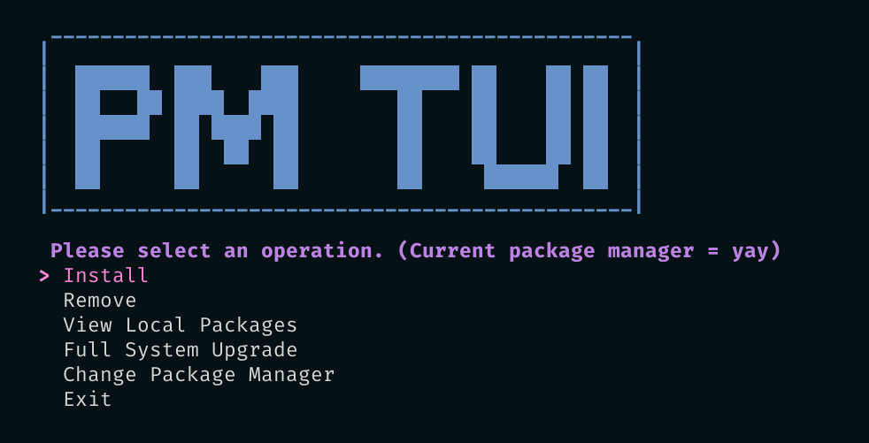

<!-- Improved compatibility of back to top link: See: https://github.com/othneildrew/Best-README-Template/pull/73 -->
<a name="readme-top"></a>
<!--
*** Thanks for checking out the Best-README-Template. If you have a suggestion
*** that would make this better, please fork the repo and create a pull request
*** or simply open an issue with the tag "enhancement".
*** Don't forget to give the project a star!
*** Thanks again! Now go create something AMAZING! :D
-->


<!-- PROJECT SHIELDS -->
<!--
*** I'm using markdown "reference style" links for readability.
*** Reference links are enclosed in brackets [ ] instead of parentheses ( ).
*** See the bottom of this document for the declaration of the reference variables
*** for contributors-url, forks-url, etc. This is an optional, concise syntax you may use.
*** https://www.markdownguide.org/basic-syntax/#reference-style-links
-->
<!-- PROJECT LOGO -->
<br />
<div align="center">
  <a href="https://github.com/thefudgeishot/pmtui">
    
  </a>

<h3 align="center">Package Manager TUI</h3>

  <p align="center">
    Package Manager TUI or pmtui is a shell program that will allow you to search, install and update your device through the native package manager all with a fancy front end.
    <br />
    <br />
    <br />
    <a href="https://github.com/thefudgeishot/pmtui/issues">Report Bug</a>
    ·
    <a href="https://github.com/thefudgeishot/pmtui/issues">Request Feature</a>
  </p>
</div>

<!-- ABOUT THE PROJECT -->
## The Project
<div align="center">

</div>
<p align="right">(<a href="#readme-top">back to top</a>)</p>

<!-- GETTING STARTED -->
## Getting Started

This project is simple to install and run.

### Prerequisites

All preqreuisites are required to ensure the project works the way it is expected.

* Gum [https://github.com/charmbracelet/gum](charmbracelet/gum)
  ```sh
  pacman -S gum
  ```

### Installation

1. Ensure your in your home directory.
2. Clone the repo
   ```sh
   git clone https://github.com/thefudgeishot/pmtui.git
   ```
3. Move shell file to home directory
   ```sh
   cp ~/pmtui/pmtui.sh ~/
   ```
4. Run the program with sudo and define your package manager. (Currently only yay and pacman have been tested but most package managers that run similar syntax 'yay -S' to install, 'yay -R' to remove, etc. Should work as well.)
```sh
sudo bash pmtui.sh

Please select a installed package manager.
> Yay
  Pacman
  Other...
```

<p align="right">(<a href="#readme-top">back to top</a>)</p>


<!-- USAGE EXAMPLES -->
## Usage

To run the program simply execute the bash script with sudo and navigate through the fancy menus.
```sh
sudo bash pmtui.sh
```

<p align="right">(<a href="#readme-top">back to top</a>)</p>


<!-- LICENSE -->
## License

Distributed under the MIT License. See `LICENSE` for more information.

<p align="right">(<a href="#readme-top">back to top</a>)</p>

